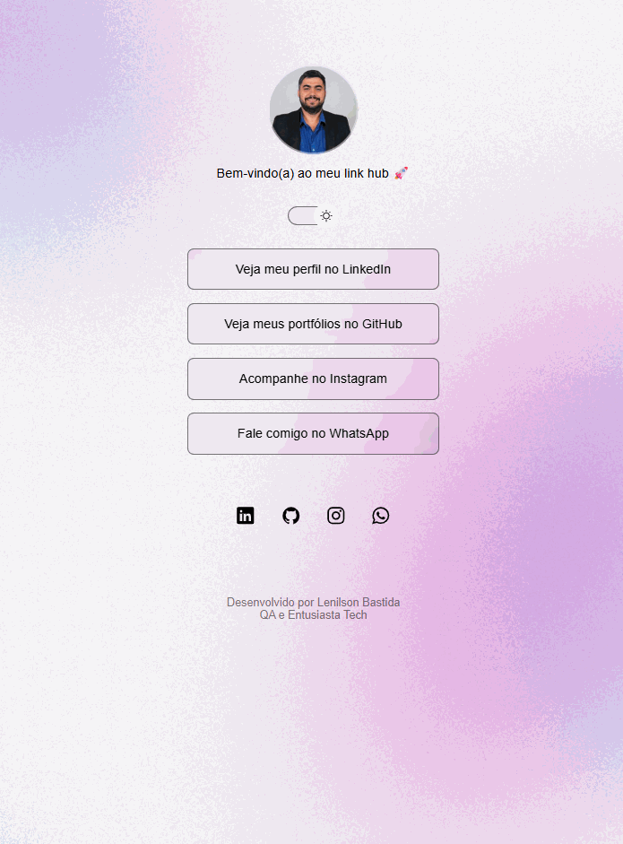

# 🚀 Projeto Social Links - Link Hub Pessoal

Bem-vindo(a) ao meu projeto prático com **HTML**, **CSS** e **JavaScript**: um hub de links pessoal, desenvolvido com o objetivo de apresentar meus principais canais de contato e redes sociais de forma elegante, responsiva e moderna.

---

## ✨ Sobre o Projeto

O **Social Links** é uma página web inspirada em plataformas como o Linktree, com o propósito de reunir em um só lugar meus principais links profissionais e pessoais. A interface é moderna, responsiva e com suporte a **modo claro/escuro**, tornando a experiência do usuário agradável em qualquer dispositivo.

---

## 🛠 Tecnologias Utilizadas

- **HTML5** – Estruturação semântica da página
- **CSS3** – Estilização com uso de variáveis, efeitos e responsividade
- **JavaScript** – Para alternância entre os modos light/dark
- **Ionicons** – Ícones modernos via CDN
- **Google Fonts (Inter)** – Tipografia legível e profissional

---

## 🎯 Funcionalidades

- ✅ Apresentação com foto e mensagem personalizada
- ✅ Lista de links com botões clicáveis e acessíveis
- ✅ Ícones sociais com efeito de hover
- ✅ Modo Claro e Escuro com alternância dinâmica
- ✅ Responsividade para dispositivos móveis
- ✅ Abertura de links externos em nova aba

---

## 📸 Preview do Projeto

<!-- Adicione aqui um print ou gif do projeto -->

